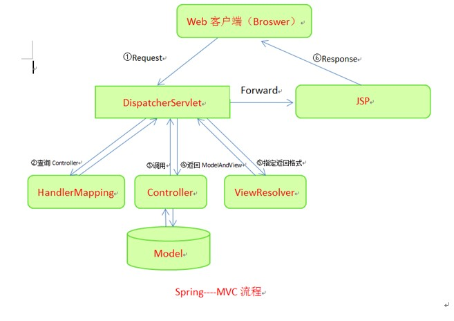
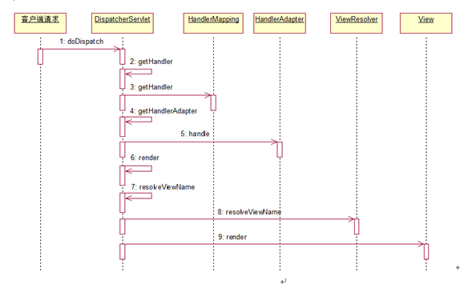

#<div align = center>系统架构设计说明书</div>
=======================

***

| 版本               | 内容                | 时间           | 作者       |  
| ------------------ |:-------------------:|:--------------:| ----------:|
| V0.1               | WEB架构图           | 2015.06.07     | haishuiaa  |
|                    |                     |                |            |
|                    |                     |                |            |

========================

##1.目的

***

&#160; &#160; &#160; &#160;本文档的编写目的是描述系统的架构设计方案，包括系统的软件总体架构设计以及使用的框架说明，以及基于该框架的开发流程，并作为指导开发人员、测试人员进行系统开发及测试的依据

##2.系统架构设计

***

&emsp;&emsp;第一阶段是web开发，使用的框架是spring mvc架构，整个web框架采用分层的概念，明确分离了表现层和业务逻辑处理层和数据层。能够保证应用逻辑的一致性和稳定性，保证结构的开发性、功能的可扩展性和可维护性。数据层和视图层使用开源框架和开源组件，基于优秀开源软件和框架开发应用，可以缩短项目的开发周期、降低开发风险、增强系统的稳定性。

<div align = center>系统总体架构图</div>

&emsp;&emsp;&emsp;&emsp;&emsp;&emsp;

&emsp;&emsp;系统总体架构图如上图所示，按照功能分为用户管理服务，资源下载服务，web服务，其中下载的组件中包括android和iphone app安装包，以及java api和c++ api、rest api下载包。系统根据功能特点与业务需求，暂时采用B/S架构模式，数据库使用mysql，mongodb作为内存数据库。技术架构采用J2EE标准架构，基于spring mvc并且集成struts，bootstraps，angularJS，mybatis开源框架，以后称为WEB子系统。

##3.Web子系统架构设计

***

###3.1.web系统架构图

&emsp;&emsp;&emsp;&emsp;&emsp;&emsp;

从架构图中可以看出系统分为四层：

- 用户层：浏览器

- 表示层：使用bootstrap框架，基于EXT/easyUI/angularJS框架，strus框架

- 业务层：借助spring进行业务组件的组装关联

- 数据持久层：借助mybatis实现

 为什么采用这样的四层架构？
 
- 通过成熟的开源产品实现各层，同自己编写代码实现，相比之下能缩短开发周期，且架构所用到的开源产品，经受过实践的考验，质量和性能更有保障

- 层与层之间松散耦合，增加代码重用率

- 各层分工明确，这样有利于团队明确分工

&emsp;&emsp;系统的总体架构从结构上分为用户层、表示层、业务层、数据访问层以及层间传递数据的数据传输对象，下面就对各层加以描述

1)	用户层

&emsp;&emsp;用户层作为客户端程序，用来与用户交互，并把来自系统的信息显示给用户，系统的用户层要求可以使用IE7.0以上或谷歌类浏览器作为交互方式

2)	表示层

&emsp;&emsp;表示层主要是控制外观，产生页面逻辑以及对用户输入的数据进行合法性验证。系统中主要包括bootstraps前端框架，基于easyUI框架的javascript脚本以及struts框架的jsp、action、actionform。其中js脚本可以增强用户体验，jsp负责视图的功能，jsp中使用bootstraps提供的标签。Actionform bean用于在视图组件和控制器组件之间传递html表单数据，通常每个html表单对应一个actionform bean，html表单中的字段和actionform bean中的属性一一对应。Actionform的validate()方法用于对用户输入的数据进行合法性验证：action负责单个事件的流程控制

3)	业务层

&emsp;&emsp;业务层处理应用的核心业务逻辑，包括账号管理，下载管理等，spring负责对这些业务对象的管理

4)	数据访问层

&emsp;&emsp;数据访问对象把底层的数据访问操作和上层的逻辑分开。使用mysql和mongodb数据库，其中mongobd作为内存数据库

5)	数据传输对象

&emsp;&emsp;数据出书对象通常作为各个业务实体的javabean对象，负责层与层之间的数据传输。

###3.2.目录结构及包设计

<div align = center>系统目录结构表</div>

| 目录名             |                     |                  |   说明                            |  
| ------------------ |:--------------------|:---------------- |:----------------------------------|
| /root              |                     |                  | 应用上下文根目录                  |
| /root              |   /css              |                  | css样式表文件目录                 |
|                    |   /fonts            |                  | 字体文件目录                      |
|                    |   /img              |                  | 图片文件目录                      |
|                    |   /js               |                  | javascript文件目录                |
|                    |   /static           |                  | 静态html文件目录                  |
|                    |   /WEB-INF          |                  |                                   |
|                    |                     |  /classes        |  本系统的java类文件和conf配置文件 |
|                    |                     |  /jsp            |  Jsp文件目录                      |
|                    |                     |  /lib            |  组件的jar包                      |
|                    |                     |  /app-servlet.xml|  部署描述文件                     |
|                    |                     |  /web.xml        |  部署描述文件                     |
|  index.jsp         |                     |                  |  默认首页                         |


<div align = center>web app系统包结构说明</div>
 
| 包名                                     | 作用说明           |  
| --------------------------------------   |:-------------------|
|                                          |                    |
|                                          |                    |
|                                          |                    |

##4.Web子系统架构总体功能设计

***

###4.1.Spring框架

&emsp;&emsp;Spring是一个实现mvc模式的框架，对model、view和controller都提供了对应的组件
 
<div align = center>spring mvc构图</div>

&emsp;&emsp;&emsp;&emsp;&emsp;&emsp;

```
Spring mvc流程

1.客户端请求提交到DispatcherServlet

2.由DispatcherServlet控制器查询一个或多个HandlerMapping，找到处理请求的Controller

3.DispatcherServlet将请求提交到Controller

4.Controller调用业务逻辑处理后，返回ModelAndView

5.DispatcherServlet查询一个或多个ViewResoler视图解析器，找到ModelAndView指定的视图

6.视图负责将结果显示到客户端
```

<div align = center>时序图</div>

&emsp;&emsp;&emsp;&emsp;&emsp;&emsp;

1.控制层controller

&emsp;&emsp;控制器的作用是从客户端接收请求，并且选择执行相应的业务逻辑，然后把响应结构返回给客户端，我们采用的spring mvc架构的控制层原理是由DispatcherServlet统一分发请求信息，具体到哪个controller处理是由HandlerMapping定位，controller处理用户请求，处理完请求后则返回ModelAndView对象给DispatcherServlet前端控制器，ModelAndView中包含了模型（Model）和视图（View）。

2.模型model

&emsp;&emsp;Model层中是原始数据封装，只包含get/set方法，承载view和controller之间的数据传输

3.视图view

&emsp;&emsp;Spring提供的视图解析器（ViewResolver）在Web应用中查找View对象，从而将相应结果渲染给客户。

###4.1.Struts框架

***暂时放弃使用***

###4.3.easyUI框架

###4.4.angularJS框架

###4.5.bootstraps框架

   建议使用AngularUI Bootstrap框架，这一框架是基于目前非常流行的前端框架Bootstrap的，它包含了一系列的Bootstrap组件，比如Carousel、Alert、Collapse、Rating和TimePicker等。所有的这些组件都可以移植到AngularJS，支持AngularJS指令和常规的HTML元素。
   后边支持移动端网页，使用Mobile Angular UI；正和它的名字一样，这是一款HTML5 移动端 的UI 框架，允许使用 Angular JS 和 Bootstrap3来开发移动端应用。另外，它可以通过增加CSS，帮助将一个Web app转为移动端的版本。

###4.6.表单验证

&emsp;&emsp;对web应用来说，由于用户的行为是无法预测的，在表单数据在传递给业务诶之前，必须保证数据的合法性及有效性，而表单验证是保证数据合法性及有效性的重要手段。对于基于ssh框架的表单验证一般有两种形式：基于js的表单验证（前端验证）以及后端验证。

&emsp;&emsp;**前端验证：**

可以针对基本类型的有效性及合法性开发一些公共的js函数，以备整个系统统一调用。

&emsp;&emsp;**后端验证：**

使用spring mvc的表单验证，前端验证不需要提交服务器，所以优先采用前端验证

###4.7.异常处理

###4.8.日志处理

使用log4j

###4.9.	公同组件

####分页组件

####树形组件

####Dao基类

####Service基类

####Action基类

