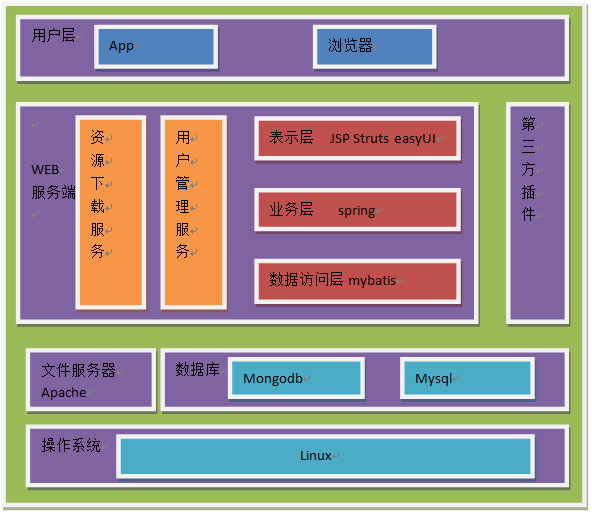
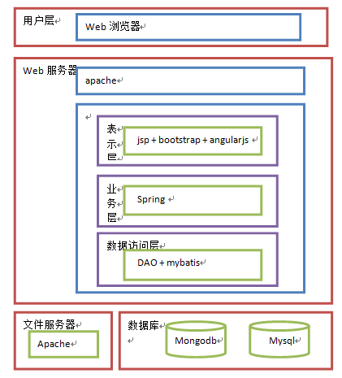

#
系统架构设计说明书

=======================

***

| 版本               | 内容                | 时间           | 作者       |  
| ------------------ |:-------------------:|:--------------:| ----------:|
| V0.1               | WEB架构图           | 2015.06.07     | gaoyanshou |
|                    |                     |                |            |
|                    |                     |                |            |

========================

##1.目的

***

&#160; &#160; &#160; &#160;本文档的编写目的是描述系统的架构设计方案，包括系统的软件总体架构设计以及使用的框架说明，以及基于该框架的开发流程，并作为指导开发人员、测试人员进行系统开发及测试的依据

##2.系统架构设计

***

&emsp;&emsp;第一阶段是web开发，使用的框架是spring mvc架构，整个web框架采用分层的概念，明确分离了表现层和业务逻辑处理层和数据层。能够保证应用逻辑的一致性和稳定性，保证结构的开发性、功能的可扩展性和可维护性。数据层和视图层使用开源框架和开源组件，基于优秀开源软件和框架开发应用，可以缩短项目的开发周期、降低开发风险、增强系统的稳定性。

系统总体架构图

&emsp;&emsp;&emsp;&emsp;&emsp;&emsp;

&emsp;&emsp;系统总体架构图如上图所示，按照功能分为用户管理服务，资源下载服务，web服务，其中下载的组件中包括android和iphone app安装包，以及java api和c++ api、rest api下载包。系统根据功能特点与业务需求，暂时采用B/S架构模式，数据库使用mysql，mongodb作为内存数据库。技术架构采用J2EE标准架构，基于spring mvc并且集成struts，bootstraps，angularJS，mybatis开源框架，以后称为WEB子系统。

##3.Web子系统架构设计

***

###3.1.web系统架构图

&emsp;&emsp;&emsp;&emsp;&emsp;&emsp;

从架构图中可以看出系统分为四层：

- 用户层：浏览器

- 表示层：使用bootstrap框架，基于EXT/easyUI/angularJS框架，strus框架

- 业务层：借助spring进行业务组件的组装关联

- 数据持久层：借助mybatis实现

 为什么采用这样的四层架构？
 
- 通过成熟的开源产品实现各层，同自己编写代码实现，相比之下能缩短开发周期，且架构所用到的开源产品，经受过实践的考验，质量和性能更有保障

- 层与层之间松散耦合，增加代码重用率

- 各层分工明确，这样有利于团队明确分工

&emsp;&emsp;系统的总体架构从结构上分为用户层、表示层、业务层、数据访问层以及层间传递数据的数据传输对象，下面就对各层加以描述

1)	用户层

&emsp;&emsp;用户层作为客户端程序，用来与用户交互，并把来自系统的信息显示给用户，系统的用户层要求可以使用IE7.0以上或谷歌类浏览器作为交互方式

2)	表示层

&emsp;&emsp;表示层主要是控制外观，产生页面逻辑以及对用户输入的数据进行合法性验证。系统中主要包括bootstraps前端框架，基于easyUI框架的javascript脚本以及struts框架的jsp、action、actionform。其中js脚本可以增强用户体验，jsp负责视图的功能，jsp中使用bootstraps提供的标签。Actionform bean用于在视图组件和控制器组件之间传递html表单数据，通常每个html表单对应一个actionform bean，html表单中的字段和actionform bean中的属性一一对应。Actionform的validate()方法用于对用户输入的数据进行合法性验证：action负责单个事件的流程控制

3)	业务层

&emsp;&emsp;业务层处理应用的核心业务逻辑，包括账号管理，下载管理等，spring负责对这些业务对象的管理

4)	数据访问层

&emsp;&emsp;数据访问对象把底层的数据访问操作和上层的逻辑分开。使用mysql和mongodb数据库，其中mongobd作为内存数据库

5)	数据传输对象

&emsp;&emsp;数据出书对象通常作为各个业务实体的javabean对象，负责层与层之间的数据传输。

###3.2.目录结构及包设计

系统目录结构表

web app系统包结构说明

 
 