#
github使用指导书

===========================================

***

##github介绍

&emsp;&emsp;当我们的项目需要多人协作的时候，有一个公共的代码文档仓库就会很方便。
由于服务器紧张，这里选择使用github。

Github是一个提供了Git代码版本管理服务的服务器，使用版本控制和代码托管有什么好处呢？

- &emsp;&emsp;我们可以通过github的网站随时随地浏览，我们的代码和文档资料（如：arduino-exercises）。

- &emsp;&emsp;我们可以跟踪所有提交到服务器的更改（也就是如果你做了坏事都会有记录 :P ，如：arduino-exercises的history）

- &emsp;&emsp;我们可以对现有的工作资料进行备份。如果碰巧你的硬盘坏了或者电脑丢了，起码网站上有一份备份。

- &emsp;&emsp;我们可以持续地对自己的工作做更改。Git支持我们对现有的内容创建分支，保存快照，合并修改等，让我们可以不断地改进作品而不影响原有的版本。

Git对文件管理流程图

&emsp;&emsp;1. Checkout。第一次使用需要从远程服务器fetch并checkout HEAD来创建本地的工作目录，之后我们便可以在工作目录里任意地添加/删除/修改文件，然后提交到本地的仓库。

&emsp;&emsp;2. Add to Index。对于新添加的文件，我们要把它加到索引（Add to Index）里面，文件的修改才会进入Git的跟踪范围。

&emsp;&emsp;3. Commit。对于已添加索引的文件， 我们只需要在要保存更改的时候，做一个“提交到本地仓库”（Commit）的操作。那么该文件的更改便在本地有历史可寻。

&emsp;&emsp;4. Push/Pull。同步本地仓库（Local Repository）和远程仓库（Remote Repository）的记录。这里用的动词很形象，Push就是把本地仓库的记录推送到服务器上，而Pull就是把服务器的记录拉到本地的仓库。

***这里稍微解释一下，由于Git是一个DVCS（Distributed Version Control System，分布式版本控制系统），不同于传统的CVS/SVN版本系统那样必须由一个中央服务器来管理所有的版本记录，它实际上每一个仓库都可独立运作，因此而称为分布式（Distributed）。Git Repos既可以是一个服务器的仓库，也可以是一个本地的文件仓库，可以存在与不同的文件夹里或别人的电脑上，它可以被无限制地fork/clone产生分支，并记下来它们的上游（upstream）是源自哪一个分支，这样当拥有相同upstream的仓库之间，就可以共享版本信息以进行版本合并操作。***

##github服务端

&emsp;&emsp;github是git项目托管网站，请先免费申请一个github帐号：www.github.com

##github客户端

&emsp;&emsp;Git:分布式版本控制工具

###windows下使用介绍

####准备工作

#####windows下git工具

**1.tortoisegit**

&emsp;&emsp;tortoisegit是类似于tortoisesvn的工具

下载地址：http://download.tortoisegit.org/tgit/1.8.14.0/

执行默认安装操作即可，右击后会发现多出几个快捷键（无法截图）

**2.msysgit**

github是服务端，要想在自己电脑上使用git我们还需要一个git客户端，我这里选用msysgit，这个只是提供了git的核心功能，而且是基于命令行的。

下载地址：http://msysgit.github.io/

执行默认安装操作即可，dos下执行git测试是否安装成功，如果执行不成功，需要设置一下环境变量path=C:\Program Files (x86)\Git\bin

然后执行git命令，如下图表示安装成功

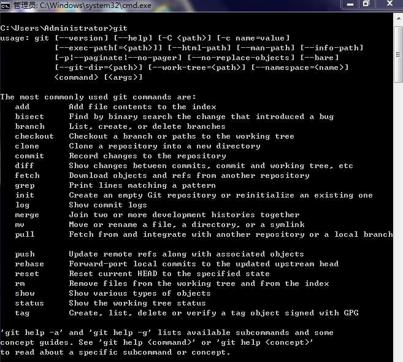

**3.git for windows**

下载地址：https://windows.github.com/

默认操作安装即可，安装完后双击打开成功，表示安装成功

####方法一

使用tortoisegit和msysgit工具

**1.创建SSH KEY**

&emsp;&emsp;GitHub选择的默认通信方式是SSH，所以要先在Git里面生成ssh key，打开Git Bash在其中输入如下命令：
ssh-keygen -t rsa -C "your_email@example.com"

&emsp;&emsp;之后会让你选择是否对存放SSH Key的文件夹进行加密，一般都不需要的。一路回车，就OK了。

&emsp;&emsp;在c盘，当前用户文件夹下，有个.ssh文件夹，在里边找到 id_rsa.pub文件，用记事本打开，复制其中的全部内容。
登陆你的GitHub账户，依次点击Account Settings > SSH Public Keys > Add another public key，把id_rsa.pub中的内容拷贝到key中，title可选。
至此，基本的设置已经完成了。

**2.然后git clone是下载工程**

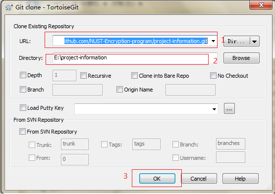

**3.执行git commit -> master**

**4.到提交成功的操作参考下图**

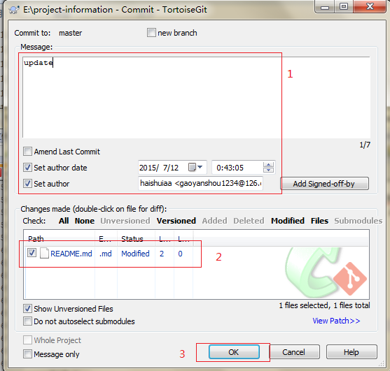

####方法二

只使用msysgit工具

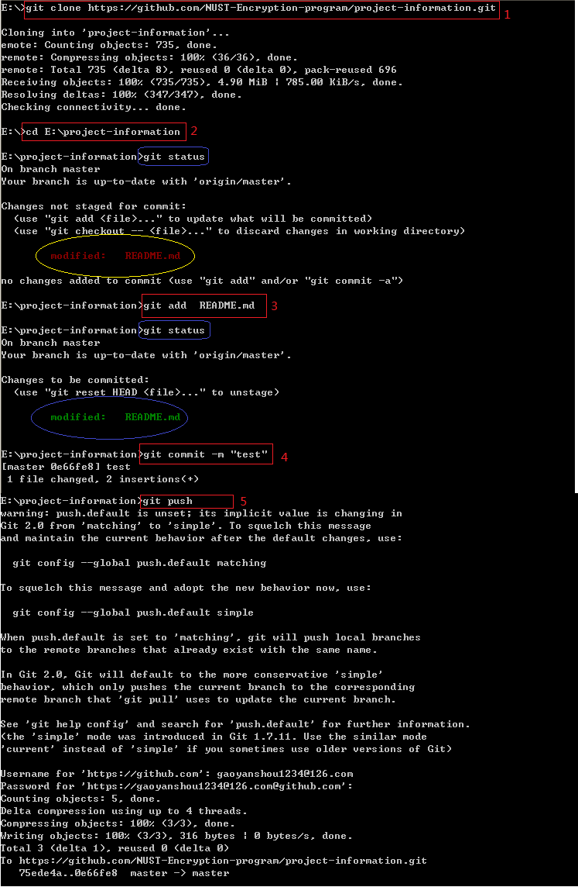

说明：1.git clone是下载工程

2.切换到下载目录

3.git add 是新增要提交的文件

git status是查看修改的文件，add后变为绿色的

4.git commit是提交动作

5.git push是提交到github服务端

其他命令可以参考git help

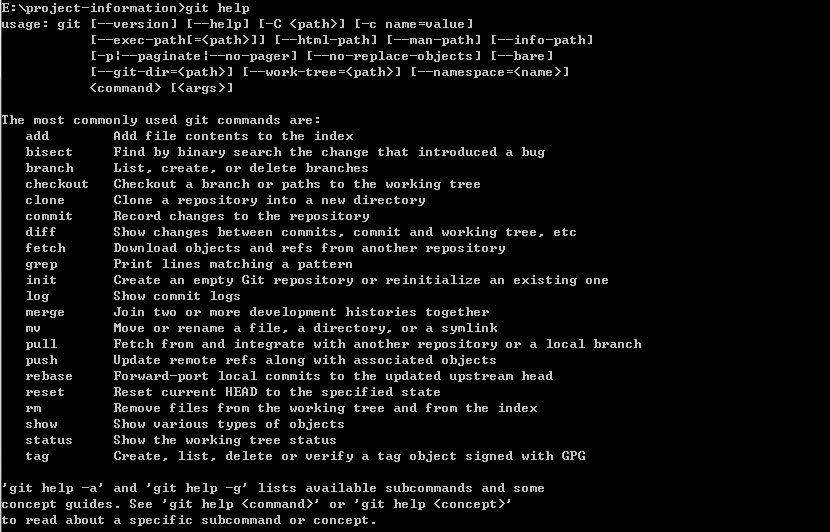

####方法三

使用git for windows工具

**1.下载github服务端工程**

双击打开github工具，需要登录github账号，登录后页面如下

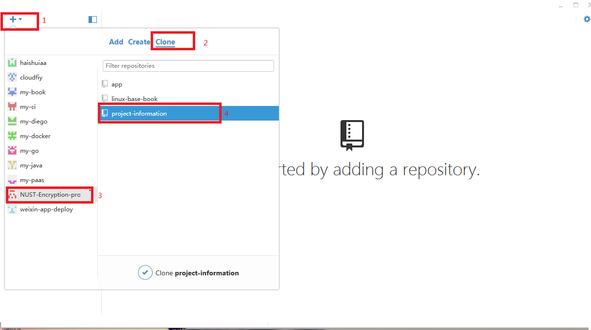

然后要下载github上的工程，操作如下图

然后点击clone，然后选择clone路径

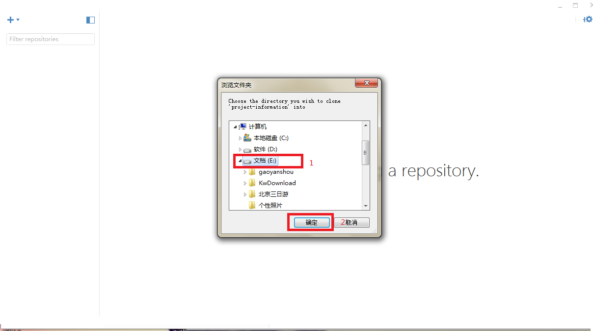

下载过程如下

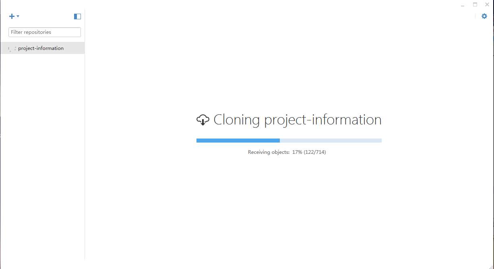

下载完成后

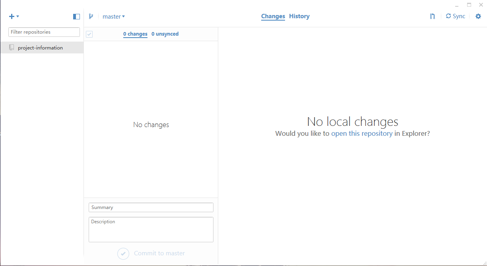

**2.上传修改内容**

如果有修改的会类似下图显示

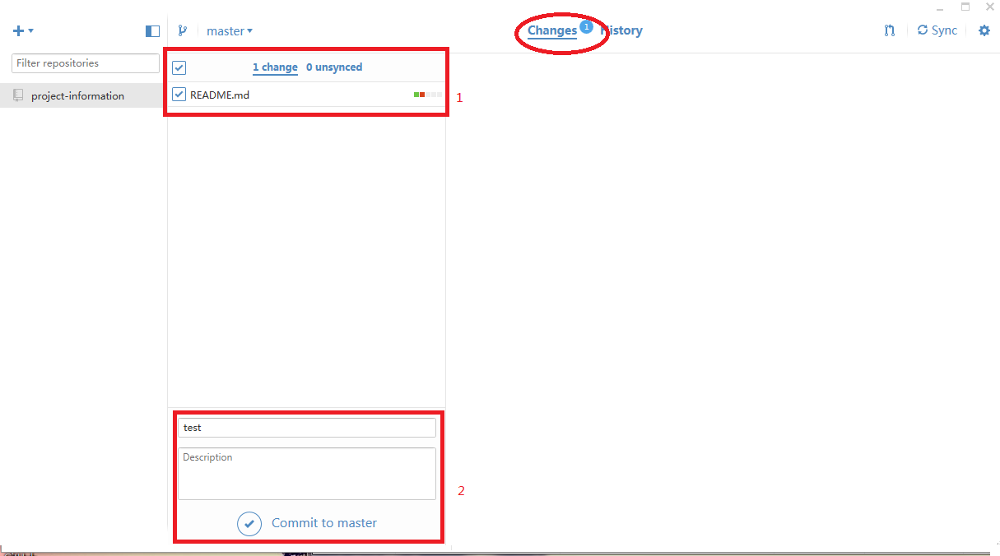

commit之后如下图显示

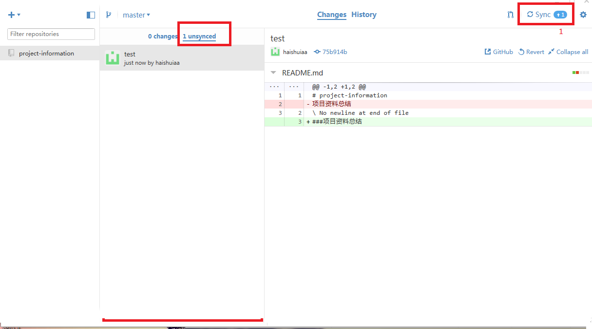

然后点击sync同步键，显示如下图，表示上传ok

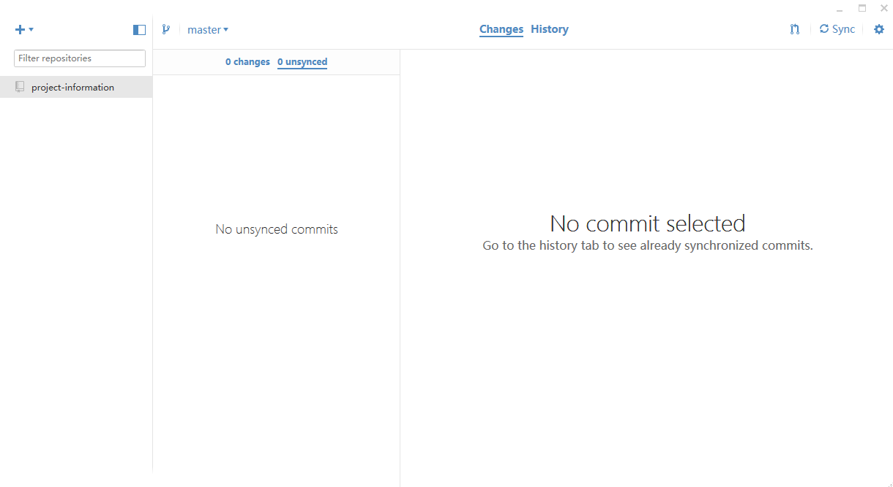

####注意

github服务端工程管理，存在父子工程关系，

譬如我们的主工程是：https://github.com/NUST-Encryption-program/project-information

在使用此工程时，需要fork工程，防止工程修改的冲突

譬如fork的工程是：https://github.com/gaoyanshou/project-information

后续所有的操作需要在fork的工程中进行：包括下载，上传

######需要补充

有时候在我们想Push更新到服务器的时候，发现服务器上的版本已经有别人更新过了，即有新的其他人的Push记录没有下载到本地，这时需要我们先把别人的更改下载到本地，以确保自己是基于最新版提交的更改，才可以把本地的记录Push上去。如果别人修改的部分跟自己的部分没有重合，则应该可以自动地merge。

