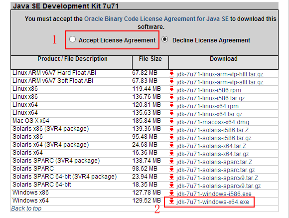

#java web环境搭建

###简介

如果一个门户网站，简单介绍下技术选型和后期的改进，第一版本前端使用bootstrap框架，后端使用spring mvc，数据库使用mysql

为了网站更加轻量级，第二版本后端切换为beego，数据库使用mongodb

###第一版本环境搭建

####准备工作

- 1.Eclpise luna的下载与安装

（1）打开浏览器，在地址栏中输入下面地址，进入Eclipse下载页面。

[下载地址]：http://www.eclipse.org/downloads/packages/eclipse-ide-java-ee-developers/lunasr2

（2）在下载页面右侧的Download列表中有Eclipse的各种版本，如图所示。根据操作系统不同，选择适当的版本。此处单击“Windows 64-bit”超链接。

 

（3）在下图所示界面中，单击链接进行下载。
 
 
 
（4）将下载完成的压缩包进行解压缩，完成Eclipse的安装。

- 2.apache-tomcat-7.0.62的下载与安装

（1）打开浏览器，在地址栏中输入下面地址，进入Tomcat7.0下载页面。

[下载地址]：http://tomcat.apache.org/download-70.cgi
	
（2）在下载页面下方，在Core节点下包含了Tomcat7服务器安装文件的不同平台下的不同版本，如图所示，此处单击“64-bit Windows zip（pgp,md5,sha1）”超链接，打开文件下载对话框，在该对话框中单击“保存”按钮，即可将Tomcat的安装文件下载到本地计算机中。

 
 
（3）将下载后的apache-tomcat-7.0.62.zip双击进行解压，解压后的文件就可以直接使用，不需要进行安装。
 
- 3.jdk1.7.0_71的下载与安装

（1）打开浏览器，在地址栏中输入下面地址，进入jdk下载页面。

[下载地址]：http://www.oracle.com/technetwork/java/javase/downloads/java-archive-downloads-javase7-521261.html#sjre-7u71-oth-JPR

（2）在新页面中，同意协议并根据计算机硬件和系统选择适当的版本进行下载，这里选择“jdk-7u71-windows-x64.exe”。如图所示。

- 4.apache-maven-3.3.1

[下载地址]：http://mirrors.hust.edu.cn/apache//maven/maven-3/3.3.1/binaries/

- 5.mysql5.6

[下载地址]：http://dev.mysql.com/downloads/mysql/

####环境搭建

参考文章：http://blog.csdn.net/haishuitian1/article/details/45066617
		  
参考文章：http://blog.csdn.net/haishuitian1/article/details/42783793
		  

