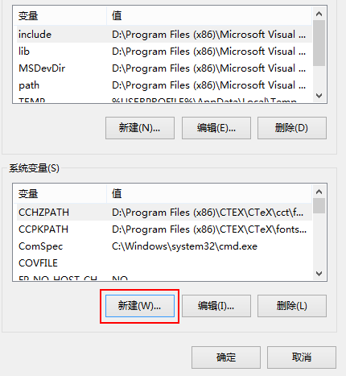
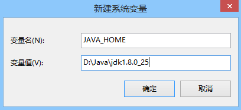
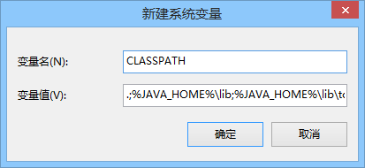
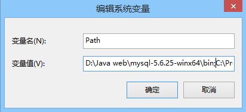
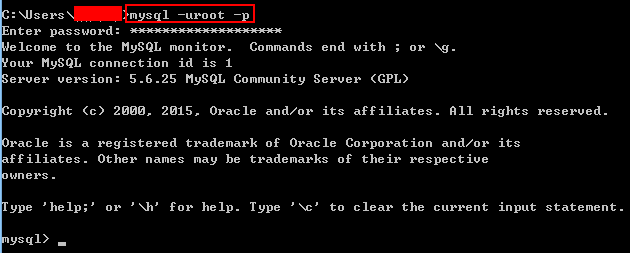

#java web环境搭建
==================================

***
##目录
==================================
* [1.简介](#1) 
* [2.项目环境搭建v1](#2) 
	* [2.1准备工作](#2.1) 
		* [2.1.1开发工具准备](#2.1.1) 
			* [Eclpise luna的下载与安装](#2.1.1.1) 
			* [jdk1.7.0_71的下载与安装](#2.1.1.2)
			* [apache-tomcat-7.0.62的下载与配置](#2.1.1.3)
			* [apache-maven-3.3.1的下载与配置](#2.1.1.4)
			* [mysql5.6的下载与安装](#2.1.1.5)
		* [2.1.2代码准备](#2.1.2)
	* [2.2.环境搭建](#2.2)
		* [2.2.1web工程环境搭建](#2.2.1)

==================================

##<h2 id="1">1.简介</h2>

&emsp;&emsp;简单介绍下技术选型和后期的改进，第一版本前端使用bootstrap+angularJS框架，后端使用spring mvc，数据库使用mysql

为了网站更加轻量级，第二版本后端切换为beego+rest，数据库使用mongodb

==================================
##<h2 id="2">2.项目环境搭建v1</h2>

&emsp;&emsp;项目第一版本的环节搭建

###<h3 id="2.1">2.1.准备工作</h3>
####<h4 id="2.1.1">2.1.1开发工具准备</h4>

<h5 id="2.1.1.1">Eclpise luna的下载与安装</h5>

* 打开浏览器，在地址栏中输入下面地址，进入Eclipse下载页面。

[下载地址]：http://www.eclipse.org/downloads/packages/eclipse-ide-java-ee-developers/lunasr2

* 在下载页面右侧的Download列表中有Eclipse的各种版本，如图所示。根据操作系统不同，选择适当的版本。此处单击“Windows 64-bit”超链接。

 

* 在下图所示界面中，单击链接进行下载。
 
 
 
* 将下载完成的压缩包进行解压缩，完成Eclipse的安装。

<h5 id="2.1.1.2">jdk1.7.0_71的下载与安装</h5>

（1）打开浏览器，在地址栏中输入下面地址，进入jdk下载页面。

[下载地址]：http://www.oracle.com/technetwork/java/javase/downloads/java-archive-downloads-javase7-521261.html#sjre-7u71-oth-JPR

（2）在新页面中，同意协议并根据计算机硬件和系统选择适当的版本进行下载，这里选择“jdk-7u71-windows-x64.exe”。如图所示。

 

（3）下载完成后双击exe安装程序，出现安装程序界面，如图所示。

（4）单击“接受”按钮，在弹出的自定义安装界面对话框中可以选择JDK的安装路径，默认为C盘，如图所示。

（5）如果不想使用系统默认的安装路径，单击“更改”按钮，在弹出来的更改当前目标文件夹对话框中，可以重新选择JDK的安装路径，如图所示。

（6）单击“确定”按钮，重新回到自定义安装界面，然后单击“下一步”按钮，系统会自动安装，直到出现已安装成功的界面，表示Java JDK安装成功，如图所示。

（7）JDK开发工具安装成功后，接下来便是对JDK进行环境变量的设置。在桌面上选中“我的电脑”，单击鼠标右键，在弹出来的菜单中，单击“属性”。

（8）在弹出的系统属性的对话框中，单击“高级”选项卡，然后单击“环境变量”按钮，如图所示。

 
 
 （9）在弹出的环境变量的对话框中单击“新建”按钮，如图所示。
 
 
 
 （10）单击“新建”按钮，弹出“新建系统变量”对话框，在这里需要设置3个变量，分别为：JAVA_HOME、CLASSPATH和Path。如图所示。
 
 新建JAVA_HOME：在变量名输入框中输入JAVA_HOME，在变量值输入框中输入JDK的安装目录。
 
 新建CLASSPATH：在变量名输入框中输入CLASSPATH，在变量值输入框中输入.;%JAVA_HOME%\lib\dt.jar;%JAVA_HOME%\lib\tools.jar
 
 打开Path：在变量值输入框中的最后输入%JAVA_HOME%\bin;%JAVA_HOME%\jre\bin（注意原来Path的变量值末尾有没有分号，如果没有先输入分号再输入上面的代码）。

 
 
 
 
 
 
 （11）检验JDK环境是否搭建成功，运行cmd输入java -version（java和-version之间有空格），若如图所示，显示版本信息，则说明安装和配置成功。

  

<h5 id="2.1.1.3">apache-tomcat-7.0.62的下载与配置</h5>

（1）打开浏览器，在地址栏中输入下面地址，进入Tomcat7.0下载页面。

[下载地址]：http://tomcat.apache.org/download-70.cgi
	
（2）在下载页面下方，在Core节点下包含了Tomcat7服务器安装文件的不同平台下的不同版本，如图所示，此处单击“64-bit Windows zip（pgp,md5,sha1）”超链接，打开文件下载对话框，在该对话框中单击“保存”按钮，即可将Tomcat的安装文件下载到本地计算机中。

 
 
（3）将下载后的apache-tomcat-7.0.62.zip双击进行解压，解压后的文件就可以直接使用，不需要进行安装。
 
（4）Tomcat下载成功后，接下来便是对Tomcat进行环境变量的设置。在桌面上选中“我的电脑”，单击鼠标右键，在弹出来的菜单中，点击“属性”。

（5）在弹出的对话框中单击“高级”选项卡，然后单击“环境变量”，如图所示。

 

（6）在弹出来的“环境变量”对话框中，单击“新建”，如图所示。

 

（7）单击“新建”，弹出“新建系统变量”对话框，在这里需要设置3个变量，分别是：CATALINA_HOME、CATALINA_BASE和Path。如图所示。

 新建CATALINA_HOME:在变量名输入框中输入CATALINA_HOME，在变量值输入框中输入Tomcat的安装目录。

 新建CATALINA_BASE:在变量名输入框中输入CATALINA_BASE，在变量值输入框中输入Tomcat的安装目录。

 打开Path：在变量值输入框中最后输入%CATALINA_HOME%\lib;%CATALINA_HOME%\bin

 
 
 
  
 
 
（8）在cmd命令下输入：startup，如果出现如下对话框，表明服务启动成功。

 
 
（9）启动成功后，测试Tomcat，打开浏览器，在地址栏中输入127.0.0.1:8080回车，如果看到Tomcat自带的一个JSP页面，说明JDK和Tomcat已搭建成功。如图所示。

 
 
<h5 id="2.1.1.4">apache-maven-3.3.1的下载与配置</h5>

（1）打开浏览器，在地址栏中输入下面地址，进入下载页面。

[下载地址]：http://mirrors.hust.edu.cn/apache//maven/maven-3/3.3.1/binaries/

（2）在新页面中，选取任一链接点击进行下载，如图所示。

 

（3）将下载后的apache-maven-3.3.1-bin.zip双击进行解压，解压后的文件就可以直接使用，不需要进行安装。

（4）解压成功后，对maven进行环境变量的设置。和JDK、Tomcat设置环境变量一样，这里需设置两个变量，分别是：M2_HOME和Path。如图所示。

 新建M2_HOME：在变量名输入框中输入M2_HOME，在变量值输入框中输入maven的安装目录。

 打开Path：在变量值输入框中最后输入%M2_HOME%\bin
 
 
 
 
 
（5）在cmd命令下输入：mvn -v（注意mvn和-v之间有空格），如果出现如下对话框，表明maven配置成功。

 

<h5 id="2.1.1.5">mysql5.6的下载与安装</h5>

（1）打开浏览器，进入MySQL官网下载mysql5.6。这里我们使用ZIP Archive版。

[下载地址]：http://dev.mysql.com/downloads/mysql/

 

（2）点击“Download”后进入另一个页面，点击“No thanks,just start my download”进行下载。

（3）ZIP Archive版是免安装的，直接解压就可以了。将下载好的mysql-x.x.xx-winx64.zip解压到你想安装的地方。

（4）下面安装mysql服务。在C:\Windows\System32目录下找到cmd.exe，右键以管理员身份运行。

 

（5）以管理员身份打开cmd窗口后，将目录切换到你解压文件的bin目录。再输入mysqld install回车运行就可以了。若出现下面界面则表示安装成功。

 
 
（6）安装成功后接着输入net start mysql启动服务。也可以选择手动启动mysql服务。

 
 
（7）打开MySQL。将目录切换到D:\Java web\mysql-5.6.25-winx64\bin（以你的路径为准），输入mysql -uroot -p，默认是没有密码的，回车进入。有密码的话，输入mysql -uroot -p回车输入密码。设置密码的方法：输入mysqladmin -uroot -p password 密码。（注意直接关闭cmd窗口并没有退出，要输入exit才会退出）

 
 
（8）虽然打开了mysql，但过程较繁琐。解决的办法是，右键我的电脑->属性->高级系统设置->环境变量->Path->编辑，将你的mysql软件下的bin目录的全路径放里面。这里建议放在最前面，最后在目录的路径后面加个英文的分号，保存就可以了。

 

（9）配置好了环境变量，再运行一下，在cmd命令下输入：mysql -uroot -p，回车输入密码，再回车。

 

###<h3 id="2.1">2.2.环境搭建</h3>

参考文章：http://blog.csdn.net/haishuitian1/article/details/45066617
		  
参考文章：http://blog.csdn.net/haishuitian1/article/details/42783793

<h4 id="2.1">2.2.1web工程环境搭建</h4>

wen工程使用的是java，搭建需要以下步骤

（1）预备工作是：上节中提到的软件都下载且安装ok

（2）下载工程代码：https://github.com/NUST-Encryption-program/app.git

（3）打开eclipse，然后右边空白处右击->Import->Existing Maven Projects然后导入下载的工程

（4）导入工程后，就可以执行Run As->Maven install，如果使用maven编译成功的话，表示导入的工程没有问题

（5）创建server，导入tomcat服务器。New->Server->Tomcat7.0

（6）然后将war工程运行在tomcat容器中

（7）最后在浏览器中输入127.0.0.1:8080/app，会出现如下页面

 
		  

