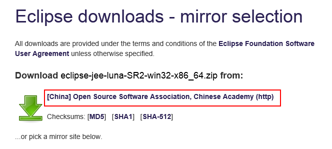
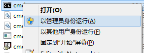

#java web环境搭建
==================================

***
##目录
==================================
* [1.简介](#1) 
* [2.项目环境搭建v1](#2) 
	* [2.1准备工作](#2.1) 
		* [2.1.1开发工具准备](#2.1.1) 
			* [Eclpise luna的下载与安装](#2.1.1.1) 
			* [jdk1.7.0_71的下载与安装](#2.1.1.2)
			* [apache-tomcat-7.0.62的下载与配置](#2.1.1.3)
			* [apache-maven-3.3.1的下载与配置](#2.1.1.4)
			* [mysql5.6的下载与安装](#2.1.1.5)
		* [2.1.2代码准备](#2.1.2)
	* [2.2.环境搭建](#2.2)
		* [2.2.1web工程环境搭建](#2.2.1)

==================================

##<h2 id="1">1.简介</h2>

&emsp;&emsp;简单介绍下技术选型和后期的改进，第一版本前端使用bootstrap+angularJS框架，后端使用spring mvc，数据库使用mysql

为了网站更加轻量级，第二版本后端切换为django+rest+angularjs，数据库使用mongodb+memcache

==================================
##<h2 id="2">2.项目环境搭建v1</h2>

&emsp;&emsp;项目第一版本的环节搭建

###<h3 id="2.1">2.1.准备工作</h3>
####<h4 id="2.1.1">2.1.1开发工具准备</h4>
==================================
<h5 id="2.1.1.1">Eclpise luna的下载与安装</h5>

* 打开浏览器，在地址栏中输入[Eclipse下载地址](http://www.eclipse.org/downloads/packages/eclipse-ide-java-ee-developers/lunasr2)，进入Eclipse下载页面。

* 在下载页面右侧的Download列表中有Eclipse的各种版本，如图所示。根据操作系统不同，选择适当的版本。如果机器是64位，单击“Windows64-bit”超链接。

&emsp;&emsp;&emsp;&emsp;&emsp;&emsp;

* 在下图所示界面中，单击链接进行下载。这里  下载的是MARS.1版本
 
&emsp;&emsp;&emsp;&emsp;&emsp;&emsp;
 
* 将下载完成的压缩包进行解压缩，完成Eclipse的安装。

==================================
<h5 id="2.1.1.2"> jdk8u73的下载与安装</h5>

* 打开浏览器，在地址栏中输入[JDK下载地址](http://www.oracle.com/technetwork/java/javase/downloads/jdk8-downloads-2133151.html)，进入jdk下载页面。

* 根据自己机型的不同，选择相应的版本，由于我机器是64位系统，这里选择“jdk-8u73-windows-x64.exe”。如图所示。

&emsp;&emsp;&emsp;&emsp;&emsp;&emsp;

* 下载完成后双击exe安装程序，出现安装程序界面，按照指导一步一步安装，直到出现已安装成功的界面，表示安装程序已经结束。

* 正常安装结束后，已经可以使用，如果你不确定是否安装成功的话，可以切换到dos下，执行java -version，如果安装ok的话，会显示如下图

&emsp;&emsp;&emsp;&emsp;&emsp;&emsp;

* 如果使用java -version并没有显示java版本信息，那么，我们就需要手动设置jdk的环境变量。具体设置环境变量步骤：

	（1）在桌面上选中“我的电脑”，单击鼠标右键，在弹出来的菜单中，单击“属性”。

	（2）在弹出的系统属性的对话框中，单击“高级”选项卡，然后单击“环境变量”按钮，环境变量对话框中有两栏，上边的一栏是属于当前用户的环节变量，下边的是属于系统级环境变量，单击下边一栏中的“新建”按钮

	（3）单击“新建”按钮，弹出“新建系统变量”对话框，在这里需要设置3个变量，变量名分别为：JAVA_HOME、CLASSPATH和Path。
 
		新建JAVA_HOME：在变量名输入框中输入JAVA_HOME，在变量值输入框中输入JDK的安装目录,这里是C:\Program Files\Java\jdk1.8.0_73。
 		新建CLASSPATH：在变量名输入框中输入CLASSPATH，在变量值输入框中输入.;%JAVA_HOME%\lib\dt.jar;%JAVA_HOME%\lib\tools.jar
 		Path一般是已经存在了，打开Path：在变量值输入框中的最后输入%JAVA_HOME%\bin;%JAVA_HOME%\jre\bin（注意原来Path的变量值末尾有没有分号，如果没有先输入分号再输入上面的代码）。

	（4）保存上述的配置，然后检验JDK环境是否搭建成功，运行cmd输入java -version（java和-version之间有空格），若如上图所示，显示了版本信息，则说明安装和配置成功。
 
==================================
<h5 id="2.1.1.3">apache-tomcat的下载与配置</h5>

* 打开浏览器，在地址栏中输入[tomcat下载地址](http://tomcat.apache.org/download-70.cgi)，进入最新Tomcat下载页面。

* 在下载页面下方，在Core节点下包含了Tomcat服务器安装文件的不同平台下的不同版本，如图所示，此处单击“64-bit Windows zip（pgp,md5,sha1）”超链接，打开文件下载对话框，在该对话框中单击“保存”按钮，即可将Tomcat的安装文件下载到本地计算机中。

&emsp;&emsp;&emsp;&emsp;&emsp;&emsp;

* 将下载后的apache-tomcat-*.zip双击进行解压，解压后的文件就可以直接使用，不需要进行安装。
 
* Tomcat下载成功后，接下来便是对Tomcat进行环境变量的设置。在桌面上选中“我的电脑”，单击鼠标右键，在弹出来的菜单中，点击“属性”。

* 同jdk环境变量操作类似，只是在这里需要设置的1个变量CATALINA_HOME。

 		新建CATALINA_HOME:在变量名输入框中输入CATALINA_HOME，在变量值输入框中输入Tomcat的安装目录。
 
* 在cmd命令下输入：startup，如果出现如下对话框，表明服务启动成功。

&emsp;&emsp;&emsp;&emsp;&emsp;&emsp;

* 启动成功后，测试Tomcat，打开浏览器，在地址栏中输入127.0.0.1:8080回车，如果看到Tomcat自带的一个JSP页面，说明JDK和Tomcat已搭建成功。如图所示。

&emsp;&emsp;&emsp;&emsp;&emsp;&emsp;

==================================
<h5 id="2.1.1.4">apache-maven-3.3.1的下载与配置</h5>

* 打开浏览器，在地址栏中输入[maven下载地址](http://mirrors.hust.edu.cn/apache//maven/maven-3/3.3.1/binaries/)，进入下载页面。

* 在新页面中，选取任一链接点击进行下载，如图所示。

&emsp;&emsp;&emsp;&emsp;&emsp;&emsp;

* 将下载后的apache-maven-3.3.1-bin.zip双击进行解压，解压后的文件就可以直接使用，不需要进行安装。

* 解压成功后，对maven进行环境变量的设置。和JDK、Tomcat设置环境变量一样，这里需设置两个变量，分别是：M2_HOME和Path。设置环境变量步骤和设置jdk环境变量类似

 		新建M2_HOME：在变量名输入框中输入M2_HOME，在变量值输入框中输入maven的安装目录。

		打开Path：在变量值输入框中最后输入%M2_HOME%\bin
 
* 在cmd命令下输入：mvn -v（注意mvn和-v之间有空格），如果出现如下对话框，表明maven配置成功。

&emsp;&emsp;&emsp;&emsp;&emsp;&emsp;

==================================
<h5 id="2.1.1.5">mysql5.6的下载与安装</h5>

* 打开浏览器，进入[mysql5.6下载地址](http://dev.mysql.com/downloads/mysql/)。这里我们使用ZIP Archive版。

 

* 点击“Download”后进入另一个页面，点击“No thanks,just start my download”进行下载。

* ZIP Archive版是免安装的，直接解压就可以了。将下载好的mysql-x.x.xx-winx64.zip解压到你想安装的地方。

* 下面安装mysql服务。在C:\Windows\System32目录下找到cmd.exe，右键以管理员身份运行。

&emsp;&emsp;&emsp;&emsp;&emsp;&emsp;

* 以管理员身份打开cmd窗口后，将目录切换到你解压文件的bin目录。再输入mysqld install回车运行就可以了。若出现下面界面则表示安装成功。

&emsp;&emsp;&emsp;&emsp;&emsp;&emsp;
 
* 安装成功后接着输入net start mysql启动服务。也可以选择手动启动mysql服务。

&emsp;&emsp;&emsp;&emsp;&emsp;&emsp;

* mysql的实用，参考[mysql总结](https://github.com/NUST-Encryption-program/project-information/tree/master/%E9%A1%B9%E7%9B%AE%E6%80%BB%E7%BB%93/%E6%95%B0%E6%8D%AE%E5%BA%93%E4%BD%BF%E7%94%A8%E6%80%BB%E7%BB%93/mysql)

####<h4 id="2.1.2">2.1.2代码准备</h4>
==================================

&emsp;&emsp;[代码下载地址](https://github.com/NUST-Encryption-program/app)

&emsp;&emsp;[代码框架介绍](https://github.com/NUST-Encryption-program/app)

###<h3 id="2.1">2.2.环境搭建</h3>
==================================

参考文章：http://blog.csdn.net/haishuitian1/article/details/45066617
		  
参考文章：http://blog.csdn.net/haishuitian1/article/details/42783793

<h4 id="2.1">2.2.1web工程环境搭建</h4>
==================================

wen工程使用的是java，搭建需要以下步骤

（1）预置开发环境：保证java，tomcat，maven安装完成且运行正常，mysql非必选，涉及数据库开发和测试时可安装

（2）下载工程代码：https://github.com/NUST-Encryption-program/app.git  &emsp;&emsp;[需要掌握git工具的使用](https://github.com/NUST-Encryption-program/project-information/blob/master/%E9%A1%B9%E7%9B%AE%E6%80%BB%E7%BB%93/%E5%B7%A5%E5%85%B7%E4%BD%BF%E7%94%A8%E6%80%BB%E7%BB%93/github%E4%BD%BF%E7%94%A8%E6%8C%87%E5%AF%BC/github%E4%BD%BF%E7%94%A8%E6%8C%87%E5%AF%BC%E4%B9%A6.md)

（3）工程导入：打开eclipse，然后右边空白处右击->Import->Existing Maven Projects然后导入下载的工程

（4）[配置jdk](http://blog.csdn.net/haishuitian1/article/details/45066881)

（5）[配置maven](http://blog.csdn.net/haishuitian1/article/details/45066881)

（6）[创建server](http://blog.csdn.net/haishuitian1/article/details/45066881)

（7）编译代码：执行Run As->Maven install，如果使用maven编译成功的话，表示导入的工程没有问题

（8）编译成功后，会在target目录下生成一个war包，将工程运行在tomcat容器中

（9）最后在浏览器中输入127.0.0.1:8080/app，会出现如下页面

&emsp;&emsp;&emsp;&emsp;&emsp;&emsp;

		  

