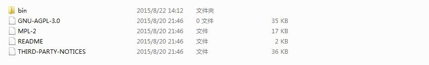
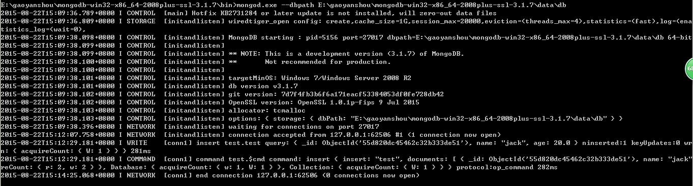
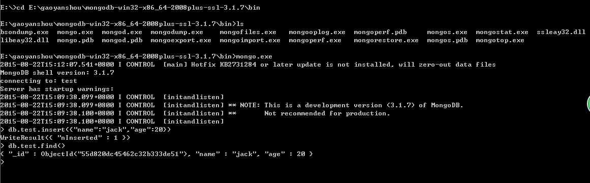

#mongodb安装
==================================

***

##简介

&emsp;&emsp;介绍mongodb的安装，二进制安装和源码安装

mongodb各个版本官方下载地址：http://www.mongodb.org/downloads

##源码安装

源码下载地址：https://github.com/mongodb/mongo

编译安装步骤参考：https://github.com/mongodb/mongo/blob/master/docs/building.md

具体实验步骤

##二进制安装

###linux下安装

这里使用的linux版本是suse sp3，下载mongodb linux相应版本后，解压后即可

验证启动,执行bin目录下的mongodb后，会报错如下

###windows下安装

http://docs.mongodb.org/manual/tutorial/install-mongodb-on-windows/?_ga=1.188199528.139831811.1440222154

根据自己windows机器的位数，下载相应的mongodb版本，这里使用64位mongodb版本，解压下载包即可

 

验证安装是否ok：直接执行bin/mongod.exe文件,一般会报如下错误,现在的版本使用ssl访问，需要两个库libeay32.dll和ssleay32.dll和ssleay32

另外是由于没有data/db，新建这个启动就ok了

启动命令是：mongod.exe --dbpath E:\gaoyanshou\mongodb-win32-x86_64-2008plus-ssl-3.1.7\data\db

 

客户端启动命令：mongo.exe

 

