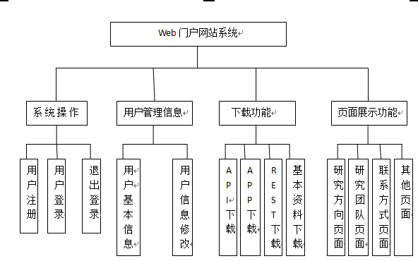

#
软件需求说明书

===============================

***

拟制：__________________&emsp;&emsp;&emsp;&emsp;&emsp;&emsp;日期：__________________

审核：__________________&emsp;&emsp;&emsp;&emsp;&emsp;&emsp;日期：__________________

批准：__________________&emsp;&emsp;&emsp;&emsp;&emsp;&emsp;日期：__________________

===============================

| 版本               | 内容                | 时间           | 作者       |  
| ------------------ |:-------------------:|:--------------:| ----------:|
| V0.1               | 软件需求说明书      | 2015.06.07     | haishuiaa  |
|                    |                     |                |            |
|                    |                     |                |            |

*说明：本软件属于开源软件*

==================================

##1.概述

###1.1.目的

&emsp;&emsp;本文档的目的是定制软件开发的细节问题，能使本软件开发工作更具体。为了使用户、软件开发者及分析和测试人员对该软件的初始规定有一个共同的理解，需要说明了软件的各项功能需求、性能需求和数据需求，明确标识各项功能的具体含义，阐述实用背景及范围，提供客户解决问题或达到目标所需要的条件或权能，提供一个度量和遵循的基准。具体而言，编写软件需求说明的目的是为所开发的软件提出：

&emsp;&emsp;a)软件设计总体要求，作为软件开发人员、软件测试人员相互了解的基础。

&emsp;&emsp;b)功能、性能要求，数据结构和采集要求，重要的接口要求，作为软件设计人员进行概要设计的依据。

&emsp;&emsp;c)软件确认测试的依据。

###1.2.编写依据

&emsp;&emsp;该《需求规格说明书》的依据。一般可以写依据XXX软件的方案书

###1.3.项目开发背景

&emsp;&emsp;由于密码学团队成员的动手能力偏弱，而且缺乏主打产品。所以特启动此项目，旨在培养团队能力和建立密码团队主打产品

###1.4.开发工具

&emsp;&emsp;eclipse luna版本用于开发java web和java API

&emsp;&emsp;eclipse android版本用于开发android app

&emsp;&emsp;vs2010用于开发c++版本API

&emsp;&emsp;sublime用于开发rest接口

&emsp;&emsp;mysql属于关系型小型数据库代表，mysql作为数据存储硬盘的工具，而mongodb作为新型nosql的代表，mongodb作为内除存储数据的代表

###1.5.术语和缩略词

##2.软件概要

###2.1.软件总体描述

&emsp;&emsp;本项目主体是web网站，主要的功能是提供用户注册和资料下载功能，以及用户管理功能。而资料下载的内容包括：c++ API/java API、REST、android app和iphone app。所有的下载的功能都需要实现

&emsp;&emsp;（1）其中API需要提供两套语言（java和c++），主要是对称加密算法和非对称加密算法的封装，目前对称密码实现AES，非对称加密算法RSA，秘钥管理使用MD5校验。

&emsp;&emsp;（2）REST接口，同样实现对称加密算法（AES）和非对称加密算法（RSA）。REST接口一般使用于web开发

&emsp;&emsp;（3）Android app和iphone app，使用（1）（2）中的接口，开发一个加解密的app，提供基本的加解密功能和账号登陆与注册功能。要求界面美观且app易用

具体可以参考下边的设计文档：

&emsp;&emsp;*API模块详细设计文档.docx*

&emsp;&emsp;*REST模块详细设计文档.docx*

&emsp;&emsp;*Android app模块详细设计文档.docx*

&emsp;&emsp;*iphone app模块详细设计文档.docx*	

###2.2.软件设计约束及有关说明

软件设计的约束以及有关说明如下所示

&emsp;&emsp;开发环境：win7/win8/mac
 
&emsp;&emsp;编程语言：c++/java/shell/swift/go
 
&emsp;&emsp;遵循的规范：软件的设计和开发过程需要严格按照合同要求，根据软件的设计方案来进行。软件开发过程应遵循软件工程规范，对过程和版本进行管理和控制。

&emsp;&emsp;测试环境：

&emsp;&emsp;软件交付形式：

&emsp;&emsp;软件交付日期：
 
&emsp;&emsp;其他：见合同。

##3.开发和运行环境

###3.1.硬件环境

软件运行环境硬件要求

| 需求名称               | 详细要求            | 
| ---------------------- |:-------------------:|
| CPU                    | NULL                |
| 内存                   |   2G以上            |    
| 硬盘                   |   1G以上            |  

###支持软件环境

| 需求名称               | 详细要求            | 
| ---------------------- |:-------------------:|
| 操作系统               | linux suse11        |
|                        |                     |    
|                        |                     |  

##4.详细需求

###4.1.性能需求

####4.1.1.精度要求

&emsp;&emsp;要按照严格的数据格式输入，对符合数据格式要求的输入进行提示。

####4.1.2.时间特性要求

&emsp;&emsp;**软件启动时间：**要求秒级启动

&emsp;&emsp;**系统实时响应时间：**软件使用过程中，对用户在各个功能模块的鼠标点击、键盘输入等操作事件的响应时间需在用户能够容忍的范围之内，一般要求小于1s。

&emsp;&emsp;**数据的转换和传送时间：**对软件不同模块间的数据交互，要求数据的转换和传送时间不得超过3s。

&emsp;&emsp;**数据更新时间：**对数据库操作数据要求不得超过1s。

####4.1.3.灵活性要求

&emsp;&emsp;软件的设计和实现需要考虑到运行环境的变化，并能够在运行环境变化的情况下正常使用。譬如web要考虑浏览器兼容和机器的屏幕适应，以及app适应不同手机的情况等。同时，软件需要兼容其他软件接口的变化，以保证在不同运行环境，不同软件接口的情况下的正常使用。具体要求如下：

（1）操作方式上的变化：软件应支持多种操作方式，例如鼠标、键盘和菜单等。

（2）运行环境的变化：软件的设计和实现需要考虑其运行环境的变化，并能对不同的运行环境提供支持。具体而言，软件应支持Windows xp版本及以上版本的操作系统，支持ie7.0以上浏览器，支持google和火狐浏览器，app支持android4.0和iphone4s以上环境。

（3）同其他软件接口的变化：当其他软件的接口发生变化时，软件应能够适应接口的变化。

（4） 精度和有效时限的变化：灵活性要求软件能够方便的适应精度和有效时限的变化。

（5）计划的变化或改进：软件应具有足够的灵活性，解耦合合扩展性要好，以适应将来有可能会出现的需求更改或增加。

###4.2.功能需求

系统功能结构图

&emsp;&emsp;&emsp;&emsp;&emsp;&emsp;

####4.2.1.系统操作块

#####4.2.1.1.普通用户注册/登录

- 注册

&emsp;&emsp;采用用户名加密码方式注册。注册成功后，成为注册用户。这里的注册方式需符合标准的注册方式，使用邮箱或是手机短信验证，验证成功后自动登录界面。注册用户权限是下载提供的内容

- 登录

&emsp;&emsp;用户使用用户名、密码和验证码方式进行登录，登录后系统自动判断身份，进入相应页面：如果是未注册用户，进入注册页面；如果是注册用户，登录成功进入首页；其他错误，提示错误并要求重新输入

- 退出

&emsp;&emsp;用户点击退出按钮后，可成功退出，非登录用户不能下载提供的内容

#####4.2.1.2.系统用户注册/登录

- 注册

&emsp;&emsp;系统用户为系统内建用户，登录密码由系统自行生产，且安全等级要高于普通用户。

- 登录

&emsp;&emsp;系统用户用于管理平面使用，实现用户的增删改查。系统用户使用内建账号进行登录对系统前台进行管理，登录成功返回管理用户页面。其登录信息以及操作信息记录到后台日志信息中（日志包含但不限于以下：登录用户名，登录IP，登录时间，行为，登出时间等）

- 退出

&emsp;&emsp;用户点击退出按钮后，可成功退出。

####4.2.2.用户管理信息

&emsp;&emsp;只有系统用户才能管理其他用户信息，普通用户只能够管理自己。

#####4.2.2.1.用户信息显示

- 系统用户

&emsp;&emsp;系统用户管理页面提供查询所有用户信息的功能，可以精确查找和模糊查找。可以显示所有用户的基本信息包括：用户名，加密密码，注册时间，有效日期等

- 普通用户

&emsp;&emsp;普通用户管理页面提供查询自己的用户信息，可以显示的基本信息包括：用户名，加密密码，注册时间，有效日期等

#####4.2.2.2.用户信息修改

- 系统用户

&emsp;&emsp;系统用户管理页面提供新增用户功能（用户等级可选：包括系统用户和普通用户）等同于注册，提供删除所有用户功能，提供修改用户功能。

- 普通用户

&emsp;&emsp;普通用户管理页面提供修改密码和其他基本信息功能，但不能修改注册手机号和邮箱等关键注册信息。

####4.2.3.下载功能

&emsp;&emsp;必须是注册用户且登录后才具备下载功能，提供下载页面和主页上的下载按钮，下载功能包括：下载c++ API/java API，REST下载，android app和iphone app下载

&emsp;&emsp;具体的下载内容的设计参考其他详细设计文档

&emsp;&emsp;*API模块详细设计文档.docx*

&emsp;&emsp;*REST模块详细设计文档.docx*

&emsp;&emsp;*Android app模块详细设计文档.docx*

&emsp;&emsp;*iphone app模块详细设计文档.docx*

####4.2.4.页面展示功能

#####4.2.4.1.首页

&emsp;&emsp;提供基本的登录注册按钮，提供下载按钮，提供用户基本信息下拉框等，是下边所有页面的总入口，可以通过本首页直接跳转到其他页面

#####4.2.4.2.注册页面

&emsp;&emsp;提供用户注册功能

#####4.2.4.3.登录页面

&emsp;&emsp;提供登录功能

#####4.2.4.4.下载页面

&emsp;&emsp;提供下载功能，包括下载c++ API/java API，REST下载，android app和iphone app下载

#####4.2.4.5.普通用户管理页面

&emsp;&emsp;提供普通用户管理功能

#####4.2.4.6.系统用户管理页面

&emsp;&emsp;提供系统用户管理功能

#####4.2.4.7.团队展示页面

&emsp;&emsp;团队成员信息展示功能

#####4.2.4.8.资料展示页面

&emsp;&emsp;基本的资料展示功能

&emsp;&emsp;*参考：前端详细设计文档.docx*

##5.故障处理需求

###5.1.软件运行故障
&emsp;&emsp;在使用软件的过程中，当出现计算机断电，计算机内存不足等情况时，web和app软件将出现运行故障。运行故障发生时，软件的各个功能模块将无法正常使用，启动相关功能按钮都无法进行正常的操作。

&emsp;&emsp;对由于计算机断电引发的软件运行故障，用户在重新给计算机供电后，可以通过重新启动计算机，并启动软件的方式恢复软件的正常运行与使用。对由于计算机内存不足引发的软件运行故障，建议暂时关闭软件。用户应检查并解决计算机内存不足的问题，内存使用情况正常后，软件将恢复正常的运行与使用。

&emsp;&emsp;出现软件运行故障并进行修复后，应确保软件功能的完整性，不能发生因本软件运行故障而导致其他软件无法继续使用的情况。

###5.2.软件使用故障

##6.质量需求

&emsp;&emsp;（1）软件功能实现必须符合常规的主流软件的使用方法和操作习惯

&emsp;&emsp;（2）提供的API要求使用简单，用户可以使用API进行一系列的开发工作

&emsp;&emsp;（3）采用可行、合理、高效的方式进行开放性的设计和实现

&emsp;&emsp;（4）软件具有很强的适应能力，并且便于维护，不仅能很好的满足当前的需求，而且应当为后期可能的开发的工作提供很好的扩展和维护接口。

&emsp;&emsp;（5）软件中的各种异常需要捕获和记录日志

##7.其他需求

###7.1.易用性需求

&emsp;&emsp;作为密码团队的首个产品，要求web app软件的设计和实现遵循易用性原则，工具的安装和入门，工具的用户界面布局，使用工具的操作方式等方面应符合主流web软件的设计风格和要求

&emsp;&emsp;（1）操作简单，设计合理

&emsp;&emsp;（2）安装实现自动化，提供日志服务

###7.2.安全性需求

####7.2.1.运行级安全

&emsp;&emsp;为保证web运行的安全，web app部署环境时禁止使用root用户部署，android app和iphone app，以及API和文档所处的服务器，用户级要求非root用户部署

####7.2.2.用户级安全

&emsp;&emsp;web提供了用户注册功能，并且提供用户平面和管理平面管理用户，管理平面实现用户的增删改查，管理平面的权限相当于root用户，管理权限用户密码安全级别要比普通用户高一级；用户管理平面要求只管理用户的基本信息。另外对数据库的操作要求非root用户操作，且需要定时备份，且要求master-slave模式。

